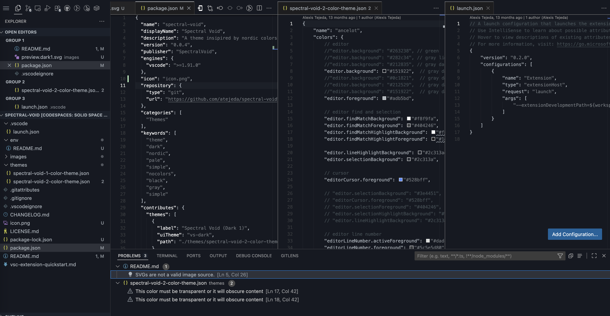

# spectral-void

A Nordic winter black metal gods theme for VS Code. Eliminate all distracting colors and immerse yourself in a focused, minimal environment designed for productivity. Spectral Void offers a dark, cold palette inspired by the stark beauty of northern winters and the raw energy of black metal. Perfect for developers who want to code in an atmosphere that emphasizes clarity, contrast, and concentration.

## Installation

## Preview

## Marketplace

- https://marketplace.visualstudio.com/items?itemName=SpectralVoid.spectral-void

## Others

- https://marketplace.visualstudio.com/manage/publishers/SpectralVoid

## Meta

- https://code.visualstudio.com/api/working-with-extensions/publishing-extension

## License

